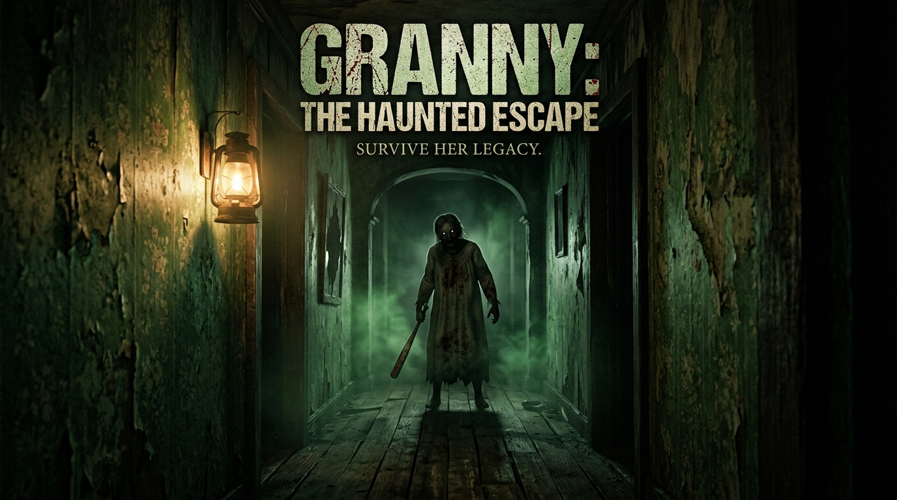
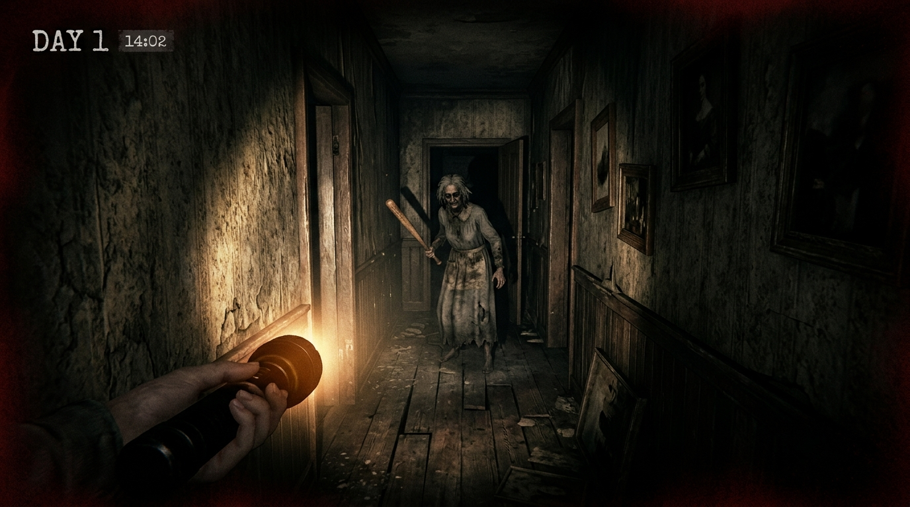
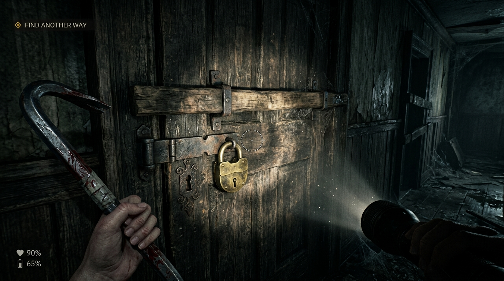
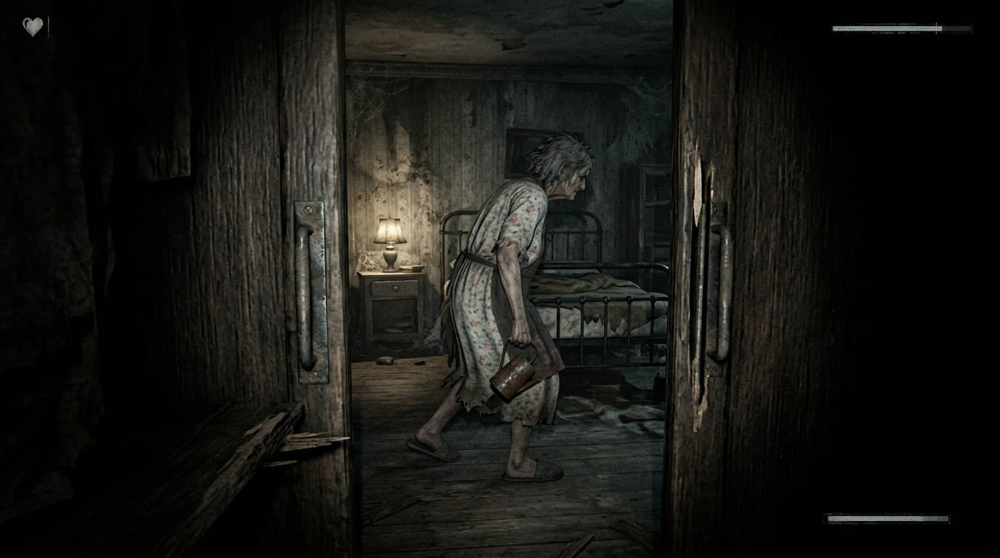
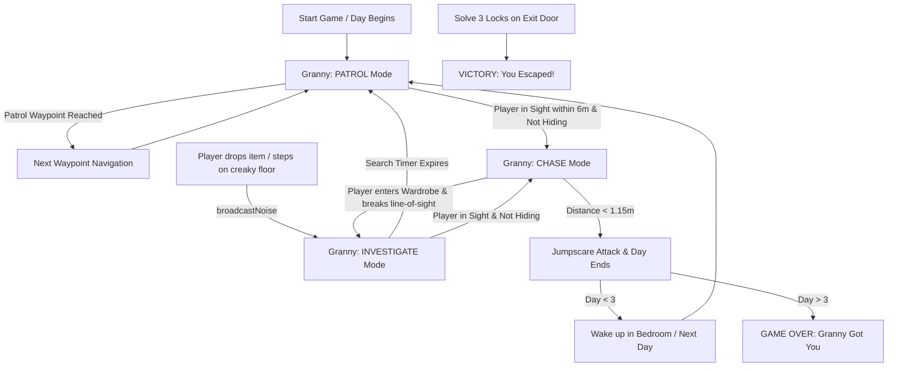

# 🏚️ GRANNY: The Haunted Escape

<p align="center">
  
</p>

<p align="center">
  <strong>An atmospheric first-person WebXR horror survival game built with A-Frame, Three.js, and procedural Web Audio.</strong>
</p>

<p align="center">
  
  
  
  
  
</p>

---

## 📖 Story & Overview

You wake up trapped inside an eerie, locked Victorian house with peeling wallpaper and creaking floorboards. You are not alone. **Granny** is roaming the corridors with a bloody baseball bat. She cannot see well in the dark, but **she hears everything**. 

Every dropped item, rushed step, or squeaking wardrobe door will draw her straight to your location. You have **3 Days** to scavenge the house, uncover the tools, solve the multi-tier lock puzzle on the front door, and escape before she claims your soul.

---

## 🎮 Gameplay Showcase

| In-Game Stalker AI Patrol | 3-Stage Exit Door Puzzle |
| :---: | :---: |
|  |  |
| *Granny stalking the hallways in search of noise* | *Examine and dismantle the 3 exit barriers* |

| Wardrobe Hiding & Stealth | Dynamic Audio & Pulse Vignette |
| :---: | :---: |
|  |  |
| *Hide inside wardrobes as Granny walks past* | *Realistic heartbeat and proximity pulse alerts* |

---

## ⚡ Core Features

- 👵 **Autonomous Sound-Sensitive Antagonist AI**:
  - **Dynamic State Machine**: Granny seamlessly transitions between `PATROL`, `INVESTIGATE`, `CHASE`, and `ATTACK`.
  - **Sound Propagation**: Creaky floorboards, sliding drawers, dropped items, and footsteps broadcast localized acoustic coordinates that alert Granny.
  - **3-Day Survival Cycle**: Getting caught triggers a terrifying jumpscare and advances the day counter. Surpass Day 3 and it's Game Over.

- 🔐 **3-Tier Interactive Escape System**:
  - **Stage 1 (Wooden Bar)**: Requires finding and prying off with the **Crowbar**.
  - **Stage 2 (Padlock)**: Requires scavenging the **Golden Padlock Key**.
  - **Stage 3 (Master Lock)**: Requires locating the elusive **Master Key** to unlock the door leaf and flee.

- 🤫 **Stealth, Search & Hiding Mechanics**:
  - **Interactive Furniture**: Open and search sliding drawers and dressers.
  - **Wardrobe Closets**: Step inside, close the wardrobe door, and hold your breath to break line-of-sight.
  - **Crouch Mode**: Lower your stance to muffle footsteps and duck beneath obstacles.
  - **Decoy Tactics**: Pick up and throw ceramic vases to deliberately lure Granny away from key puzzle objectives.

- 🔊 **100% Procedural Web Audio Engine (Zero Asset Loading)**:
  - Procedurally synthesized via the native Web Audio API — no heavy MP3/WAV downloads required!
  - Real-time **binaural drone**, **eerie music-box lullaby**, **floorboard creaks**, **metal key unlocks**, **dynamic BPM heartbeat**, and **pulse-raising chase synths**.

- 🥽 **Cross-Platform Desktop & WebXR Immersion**:
  - Play directly in any desktop browser (Chrome, Firefox, Edge, Safari) with responsive mouse look & keyboard locomotion.
  - Native VR support on **Meta Quest 2, 3, 3S, and Pro** via the Oculus Browser with 6DoF controller tracking, laser raycasting, and haptic rumble pulses synchronized to your heartbeat.

---

## 🕹️ Controls Guide

### 💻 Desktop / Laptop (Keyboard & Mouse)

| Action | Control |
| :--- | :--- |
| **Move** | <kbd>W</kbd> <kbd>A</kbd> <kbd>S</kbd> <kbd>D</kbd> or <kbd>Arrow Keys</kbd> |
| **Look Around** | Mouse Movement |
| **Interact / Pick Up / Use** | <kbd>Left Click</kbd> or <kbd>E</kbd> |
| **Drop Held Item** | <kbd>G</kbd> *(drops item & creates noise decoy)* |
| **Toggle Crouch / Stealth** | <kbd>C</kbd> |

### 🥽 Meta Quest 3 / 3S / VR Headsets

| Action | VR Controller |
| :--- | :--- |
| **Smooth Locomotion** | Left Thumbstick |
| **Smooth / Snap Turn** | Right Thumbstick / Head Tracking |
| **Interact / Open Drawer / Unlock** | Index Trigger (Laser Pointer Raycast) |
| **Drop Held Item** | Grip Button |
| **Haptics** | Real-time rumble pulses for heartbeats & jumpscares |

---

## 🗺️ House Layout & Item Guide

```
+-------------------------------------------------------------+
|                      [ MAIN EXIT FOYER ]                    |
|                (Barricade + Padlock + Master Lock)          |
+------------------------------+------------------------------+
|       KITCHEN / NOOK         |        CENTRAL HALLWAY       |
|   • Master Key in Cabinet    |   • Creaky Floorboards       |
|   • Grandfather Clock        |   • Granny Patrol Waypoint   |
+------------------------------+------------------------------+
|        LIVING ROOM           |        SPAWN BEDROOM         |
|   • Golden Padlock Key       |   • Spawn Bed & Wake-up      |
|   • Ceramic Vase (Decoy)     |   • Wardrobe (Hiding Spot)   |
|   • Sofa & Dresser Drawers   |   • Nightstand (Crowbar)     |
+------------------------------+------------------------------+
```

---

## 🛠️ Architecture & Technology Stack

- **Framework**: [A-Frame v1.6.0](https://aframe.io/) / [Three.js](https://threejs.org/)
- **Audio Synthesis**: Native HTML5 Web Audio API (`AudioContext`, `BiquadFilter`, `GainNode`, `OscillatorNode`)
- **Procedural Graphics**: Dynamic Canvas 2D texture generators for rustic wood grain and vintage floral wallpaper
- **Immersive Tech**: WebXR Device API, Gamepad API, and Touch Controller Haptic Actuators
- **Styling**: Modern CSS3 (Glassmorphism HUD, dynamic vignette heart pulse, CRT flicker title)

---

## 🚀 Quickstart & How to Play

Because the game is completely self-contained within `index.html` with zero external dependencies or build pipelines, you can run it instantly!

### Option 1: VS Code Live Server
1. Open the project folder in VS Code.
2. Right-click [`index.html`](file:///c:/Users/user/Team-BhootiyaChudail/index.html) and select **"Open with Live Server"**.

### Option 2: Python Local Server
```bash
# Python 3
python -m http.server 8000
```
Then navigate to `http://localhost:8000` in your web browser or Meta Quest Oculus Browser.

### Option 3: Node.js `http-server` / `npx serve`
```bash
npx -y serve .
```

### Option 4: GitHub Pages Deployment
1. Push this repository to GitHub.
2. Go to **Settings > Pages > Branch: main > / (root) > Save**.
3. Your game is now live on the web for anyone with a browser or VR headset!

---

## 🧠 AI Antagonist Logic Flow



---

## 📜 License & Credits

- Created for **Team BhootiyaChudail**.
- Distributed under the **MIT License**. Feel free to modify, expand rooms, and add new puzzle mechanics!
